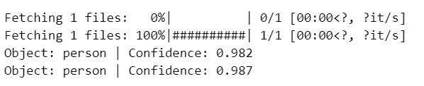
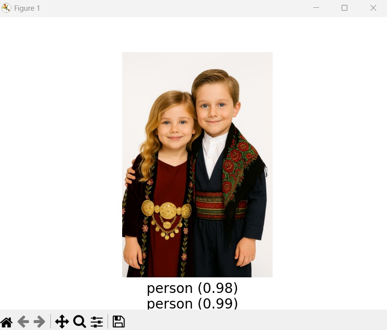
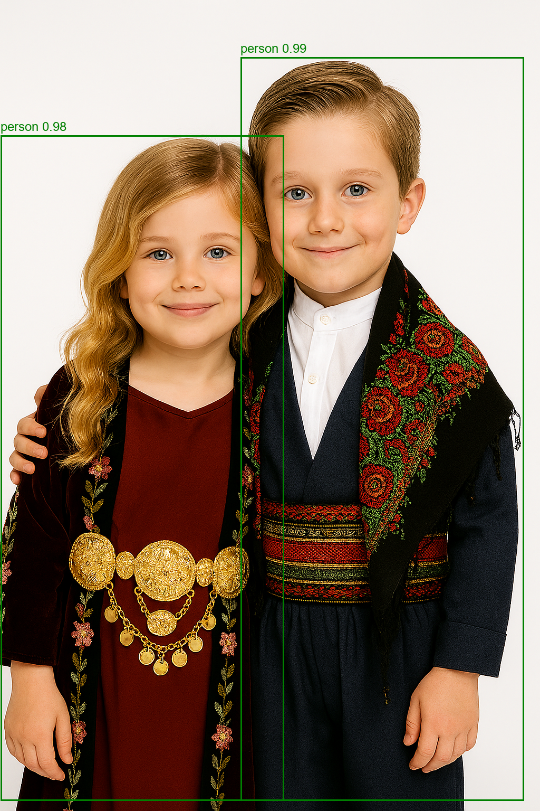

# 🎯 Real-Time Object Detection Using Webcam (Transformers + OpenCV)

This project performs **real-time object detection** using a webcam feed, powered by the **DETR (DEtection TRansformer)** model from Facebook AI, integrated with **OpenCV** and **Python**.

> Developed by **[Coder Shiyar](https://github.com/codershiyar)** 💻

---

## 📦 What's Inside?

| File | Description |
|------|-------------|
| `detect_using_webcam.py`   | Runs real-time object detection using your webcam with DETR. Detected persons are highlighted with bounding boxes and confidence scores. |
| `detect_image_visual.py`   | Runs object detection on a static image using DETR. Results are drawn directly on the image (bounding boxes + labels). |
| `detect_image_console.py`  | Runs object detection on a static image using DETR. Results (labels + confidence) are printed in the console. |
| `img.png`                  | Sample input image (AI-generated) for testing. |
| `img2.png`                 | Another sample input image (AI-generated) for testing. |
| `requirements.txt`         | List of required Python packages. |


## 🧠 What This Project Does

- Uses Hugging Face’s [DETR model](https://huggingface.co/facebook/detr-resnet-50) for object detection
- Processes frames in real-time from your **webcam**
- Detects objects such as **person, car, dog, etc.**
- Draws bounding boxes and confidence scores live
- Also supports image-based detection (for testing or demos)

---

## 🚀 Quick Start

### 1. Clone this repository

```bash
git clone https://github.com/codershiyar/real-time-object-detection-using-webcam-transformers-opencv
cd real-time-object-detection-using-webcam-transformers-opencv
```

### 2. Install the requirements

Make sure you are using Python 3.11 or later.

```bash
pip install -r requirements.txt
```

> If you don’t have a virtual environment, it’s recommended to create one first.

### 3. Run real-time detection (webcam)

```bash
python detect_using_webcam.py
```

Press **`q`** to quit the live stream.

### 4. Run detection on an image (visual overlay)

```bash
python detect_image_visual.py
```
By default this script loads imgs/img2.png.

---
### 5. Run detection on an image (console output)

```bash
python detect_image_console.py
```
By default this script loads imgs/img.png and prints the detected labels and confidence scores in the terminal.

---

## 📚 Requirements

The following Python packages are used:

```
torch
transformers
opencv-python
pillow
```

These are all included in `requirements.txt`.

---

## 🧑‍💻 Author

**Coder Shiyar**  
🔗 GitHub: [github.com/codershiyar](https://github.com/codershiyar)

---

## 📸 Screenshots (Example Results)


### 1. Detection on an Image (console output)


### 2. Detection on an Image (with bounding boxes)


### 3. Real-Time Detection Using Webcam



## ⭐️ Support

If this project helps you, feel free to star ⭐ it and share!
